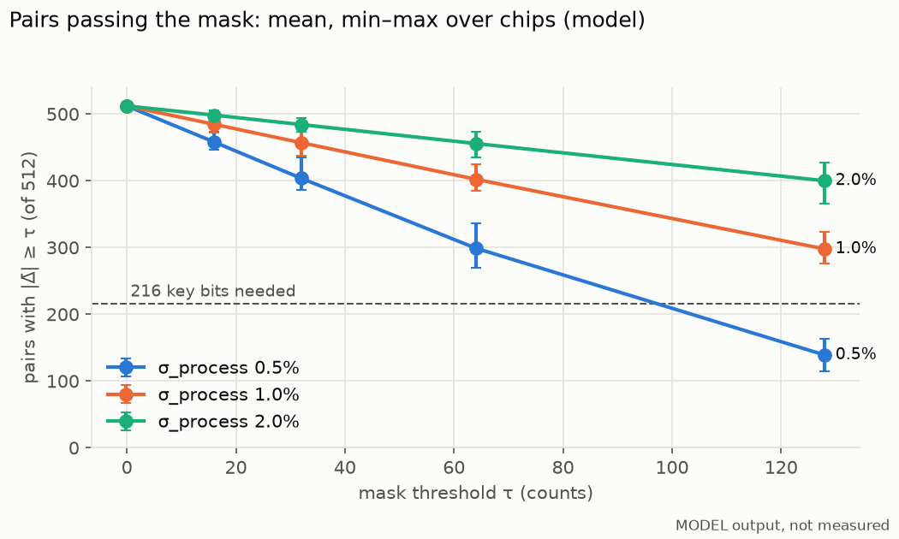
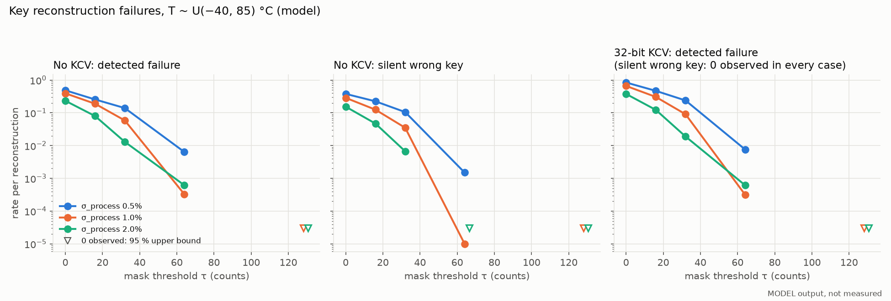
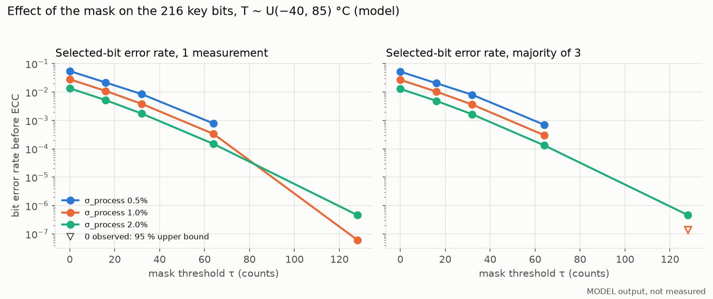
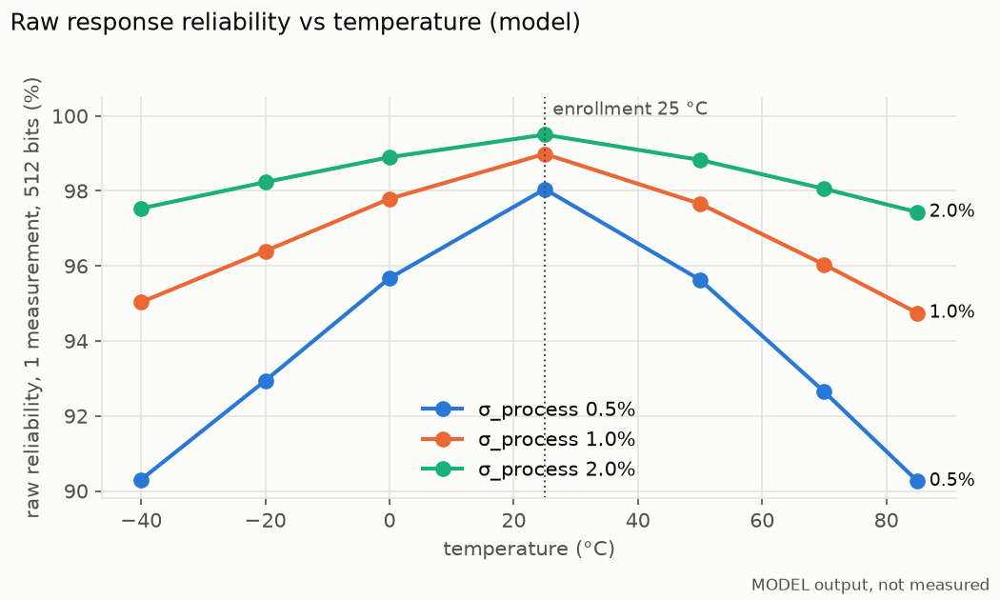
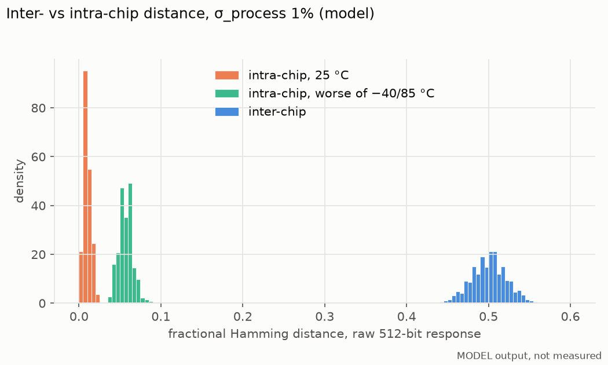
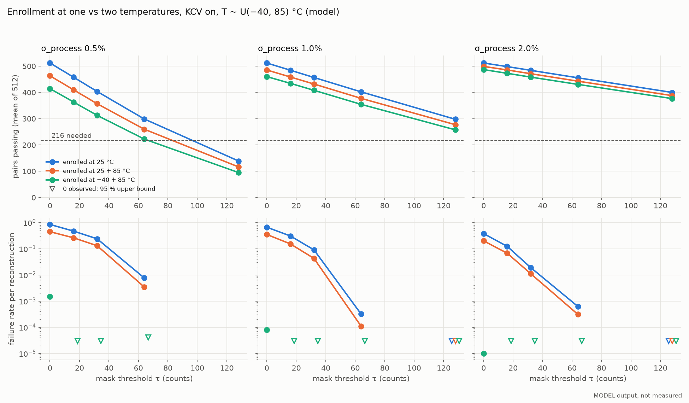

# RO-PUF key generator: behavioural model

> **Every number in this document is a model output, not a measurement.**
> The model parameters are assumptions. Replace them with values measured in
> `fpga/char/` before quoting any result as a property of real hardware:
> `fpga/char/analyze.py` fits them from race data, and
> `model/puf_montecarlo.py --params <fit.json>` reruns this study with them.

Code: [`model/ro_puf.py`](../model/ro_puf.py) (chip, measurement, enrollment,
reconstruction, key/ID/HMAC), [`model/secded.py`](../model/secded.py)
(extended Hamming (72,64) syndrome sketch, bit-exact with
[`rtl/secded72.v`](../rtl/secded72.v)), [`model/puf_montecarlo.py`](../model/puf_montecarlo.py)
(sweep). Full tables: [`puf-model/results.md`](puf-model/results.md); raw data:
[`puf-model/results.json`](puf-model/results.json).

## What is modelled

| Stage | Model |
|---|---|
| Chip | 1024 ROs. f_i(T) = f0 (1 + σ_process z_i)(1 + k_i (T − 25 °C)), z_i ~ N(0,1), k_i ~ N(tempco, σ_tempco). |
| Jitter | Each measurement multiplies every RO frequency by (1 + σ_jitter n), n ~ N(0,1), fresh per measurement. |
| Pairs | Disjoint: (2i, 2i+1), i = 0..511. |
| Measurement | Both counters start at a random phase and race; when the first reaches 2^14 the other is sampled. Δ = count(2i) − count(2i+1) (never 0); bit = Δ > 0. |
| Enrollment (25 °C by default) | Δ̄ = mean of 16 measurements per enrollment temperature; mask: same sign of Δ̄ at every enrollment temperature and \|Δ̄\| ≥ τ at each; also run at 25 + 85 °C and −40 + 85 °C (`KeyGenParams.enroll_temps_c`); first 216 passing pairs; 3 blocks × 72 bits; helper data = selected pairs + 3 × 8-bit extended Hamming (72,64) syndromes + 32-bit key-check value (KCV). Fewer than 216 passing pairs = enrollment failure. |
| Reconstruction | 3 measurements per pair, majority vote; per block, correct 1 bit; on a detected uncorrectable error re-measure that block. When all blocks decode but the KCV of the candidate key does not match (a SECDED miscorrection), re-measure all 3 blocks. At most 3 re-measurement rounds (4 attempts); a block still uncorrectable or a KCV still wrong = detected failure. |
| Key, ID, auth | K = SHA-256(216 bits, MSB first ‖ "SIDIK-K"); KCV = first 32 bits of HMAC-SHA256(K, "SIDIK-CHK"); ID = HMAC-SHA256(K, "SIDIK-ID"); tag = HMAC-SHA256(K, challenge). |
| Monte Carlo | 100 chips × 1000 reconstructions per (σ_process, τ, variant); reconstruction temperature T ~ U(−40, 85) °C; σ_process ∈ {0.5, 1, 2} %, τ ∈ {0, 16, 32, 64, 128} counts. Variants: 25 °C enrollment with and without KCV; 25 + 85 °C and −40 + 85 °C enrollment with KCV. All variants share chips and reconstruction noise streams. |

### Parameters (all assumptions)

| Parameter | Default | Basis |
|---|---|---|
| f0 | 250 MHz | Placeholder; results depend on frequency ratios, not on f0. |
| σ_process | 1 % (swept 0.5–2 %) | Assumption. |
| σ_jitter | 3·10⁻⁴ relative per measurement | Chosen so raw single-measurement BER ≈ 1 % at 25 °C with σ_process 1 %. |
| tempco | −10⁻³ /°C (common) | Assumption; the common part cancels in Δ. |
| σ_tempco | 2.5·10⁻⁵ /°C per RO | Chosen so raw BER ≈ 5 % at −40/85 °C with σ_process 1 %. |
| counter threshold | 2^14 | From the spec. |

σ_jitter and σ_tempco are fixed while σ_process is swept, so a smaller
σ_process also means a worse signal-to-noise ratio. That is the main reason
the 0.5 % rows look bad.

### Interpretation choices

The spec left these open; each is a parameter in `KeyGenParams` / the code:

- "maksimal 3 kali" is read as at most 3 **re-measurements** after the first
  attempt, and only the failing block is re-measured.
- Jitter is modelled as per-measurement frequency noise averaged over the
  counting window, not as cycle-to-cycle jitter.
- Temperature acts through a per-RO tempco spread. With a common tempco only,
  bits would never flip with temperature.
- ID and the HMAC tag are domain-separated HMACs of K. The spec named them but
  did not define them.
- Helper data stores only the 216 selected pairs, not the full 512-pair mask.
- KCV length 32 bits (`KeyGenParams.kcv_bits`; 0 disables it). A wrong key
  passes the check with probability 2⁻³².
- Two-temperature enrollment: the key bit is the sign at the first
  enrollment temperature; a pair whose sign differs between the enrollment
  temperatures is dropped regardless of τ.

## Results (model)

Selected rows; the full grid is in [`puf-model/results.md`](puf-model/results.md).
"< x" = zero events observed, 95 % upper bound (rule of three, n = 10⁵).
Failure columns are shown without and with the KCV. Both variants use the same
chips and the same noise streams, so the comparison is paired.

| σ_process | τ | pairs passing (min) | key BER, 1 meas | key BER, maj-3 | no KCV: detected | no KCV: silent wrong key | KCV: detected | KCV: silent wrong key | chips with ≥1 failure (KCV) |
|---|---|---|---|---|---|---|---|---|---|
| 1 % | 0 | 512 | 2.8·10⁻² | 2.7·10⁻² | 3.9·10⁻¹ | 2.9·10⁻¹ | 6.6·10⁻¹ | < 3·10⁻⁵ | 100/100 |
| 1 % | 32 | 437 | 3.8·10⁻³ | 3.6·10⁻³ | 5.9·10⁻² | 3.5·10⁻² | 9.1·10⁻² | < 3·10⁻⁵ | 88/100 |
| 1 % | 64 | 385 | 3.4·10⁻⁴ | 3.0·10⁻⁴ | 3.3·10⁻⁴ | 1.0·10⁻⁵ | 3.2·10⁻⁴ | < 3·10⁻⁵ | 7/100 |
| 1 % | 128 | 276 | 6·10⁻⁸ | 0 (< 1.4·10⁻⁷) | < 3·10⁻⁵ | < 3·10⁻⁵ | < 3·10⁻⁵ | < 3·10⁻⁵ | 0/100 |
| 0.5 % | 64 | 269 | 7.8·10⁻⁴ | 7.1·10⁻⁴ | 6.4·10⁻³ | 1.5·10⁻³ | 7.7·10⁻³ | < 3·10⁻⁵ | 27/100 |
| 0.5 % | 128 | 115 | – | – | all 100 chips fail enrollment | – | – | – | – |
| 2 % | 64 | 435 | 1.5·10⁻⁴ | 1.3·10⁻⁴ | 6.2·10⁻⁴ | < 3·10⁻⁵ | 6.2·10⁻⁴ | < 3·10⁻⁵ | 2/100 |
| 2 % | 128 | 366 | 5·10⁻⁷ | 5·10⁻⁷ | < 3·10⁻⁵ | < 3·10⁻⁵ | < 3·10⁻⁵ | < 3·10⁻⁵ | 0/100 |

Raw 512-pair response (model), every σ_process: uniformity 49.8–50.1 %,
uniqueness 50.0 %; reliability at 25 / −40 / 85 °C is 98.1 / 90.3 / 90.3 %
(0.5 %), 99.0 / 95.0 / 94.8 % (1 %), 99.5 / 97.5 / 97.4 % (2 %). All 100
chips got distinct IDs in every configuration that enrolled.







### Enrollment at two temperatures (model)

KCV on; failure = detected + silent (silent was 0 everywhere). Same chips and
reconstruction noise for all three enrollment variants.

| σ_process | τ | enrolled at | pairs passing (min) | chips failing enrollment | failure rate | chips with ≥1 failure |
|---|---|---|---|---|---|---|
| 1 % | 0 | 25 °C | 512 | 0/100 | 6.6·10⁻¹ | 100/100 |
| 1 % | 0 | 25 + 85 °C | 471 | 0/100 | 3.5·10⁻¹ | 100/100 |
| 1 % | 0 | −40 + 85 °C | 443 | 0/100 | 8.0·10⁻⁵ | 6/100 |
| 1 % | 32 | 25 °C | 437 | 0/100 | 9.1·10⁻² | 88/100 |
| 1 % | 32 | 25 + 85 °C | 416 | 0/100 | 4.3·10⁻² | 65/100 |
| 1 % | 32 | −40 + 85 °C | 390 | 0/100 | < 3·10⁻⁵ | 0/100 |
| 1 % | 64 | 25 °C | 385 | 0/100 | 3.2·10⁻⁴ | 7/100 |
| 1 % | 64 | 25 + 85 °C | 360 | 0/100 | 1.1·10⁻⁴ | 4/100 |
| 1 % | 64 | −40 + 85 °C | 331 | 0/100 | < 3·10⁻⁵ | 0/100 |
| 0.5 % | 16 | −40 + 85 °C | 341 | 0/100 | < 3·10⁻⁵ | 0/100 |
| 0.5 % | 64 | −40 + 85 °C | 193 | 27/100 | < 4·10⁻⁵ (73 chips) | 0/73 |
| 2 % | 0 | −40 + 85 °C | 476 | 0/100 | 1.0·10⁻⁵ | 1/100 |



## Findings (model)

1. **Only the mask removes temperature errors. Majority voting and
   re-measurement barely help.** All 3 votes and every re-measurement happen at
   the same temperature, so a pair whose frequencies cross between 25 °C and
   the current temperature gives the same wrong bit every time. At
   σ_process 1 %, τ = 0, majority-of-3 only moves key BER from 2.8 % to 2.7 %.
   Those two mechanisms only remove jitter, and in this model jitter is the
   smaller error source.
2. **Without a key check, SECDED gives wrong keys silently. The 32-bit KCV
   makes every such miscorrection detected, but does not prevent the
   failures.** Three or more errors in a block can alias to a single-bit
   syndrome and be "corrected" into a different word. Without the KCV, silent
   wrong keys are 3–88 % as frequent as detected failures (e.g. 3.5 % vs
   5.9 % at σ 1 %, τ 32). With the KCV, no silent wrong key occurred in any
   configuration (< 3·10⁻⁵ each). Those cases now count as detected failures,
   so the detected rate goes up (5.9 % → 9.1 % at σ 1 %, τ 32). Re-measuring
   after a KCV mismatch recovers only 5–12 % of them (where more than a
   handful were caught), because the
   temperature, and with it the error pattern, stays the same (finding 1).
   The KCV makes failures visible. It does not make them less frequent.
   **The choice of SECDED code matters only without the KCV.** These results
   use the extended Hamming code of `rtl/secded72.v`. An earlier version of
   this study used a Hsiao (72,64) code: without the KCV, extended Hamming
   gives 20–58 % more silent wrong keys than Hsiao in the same runs
   (σ 1 %, τ 32: 2.4 % → 3.5 %). With the KCV the failure rates of the two
   codes differ by less than 1 % and neither gives a silent wrong key.
3. **Failures are a per-chip property.** At σ 1 %, τ 64 all 34 failures come
   from 7 of 100 chips, and the worst chip fails 10 of 1000 reconstructions.
   An average failure rate hides chips that will fail in the field.
   Enrollment-time screening addresses this better than a larger τ (finding 8).
4. **τ is bounded by σ_Δ because there are only 512 disjoint pairs.** At least
   216 of 512 (42 %) must pass. For Gaussian Δ that means τ ≲ 0.80·σ_Δ.
   σ_Δ ≈ 116 / 229 / 454 counts for σ_process 0.5 / 1 / 2 %, so τ = 128 works
   at 1 % (worst chip still has 276 pairs) but fails enrollment on every chip at
   0.5 %. τ has to be set from the measured σ_Δ of the real fabric, not fixed
   in advance.
5. **This Monte Carlo cannot demonstrate a low failure rate.** With 10⁵
   reconstructions per configuration, zero observed failures only bounds the
   rate below 3·10⁻⁵ (95 %). Targets for key generators are usually much
   lower. Showing such a rate needs an analytic tail estimate from the per-bit
   error probabilities, or a far larger simulation.
6. **Uniformity and uniqueness ≈ 50 % are built into the model, not results
   about hardware.** The ROs are i.i.d. Gaussian, with no spatial gradient, no
   systematic layout bias and no correlation between neighbours. Real fabrics
   have all three. Only measurements can confirm uniformity and uniqueness.
7. **Entropy.** The syndromes publish 24 bits, so at most 192 of the 216 key
   bits remain secret, even when the bits are unbiased and independent as in
   this model. The KCV is a deterministic function of K, so a conservative
   count subtracts another 32 bits: K is 256 bits long but carries ≥ 160 and
   ≤ 192 bits of entropy. In practice the KCV only lets an attacker confirm a
   guess offline, which does not help against ≥ 160 unknown bits.

8. **Enrolling at both temperature corners removes the temperature
   failures in the model; enrolling at 25 + 85 °C only halves them.** With
   −40 + 85 °C enrollment no reconstruction failed at any τ ≥ 16, for every
   σ_process that enrolled (< 3·10⁻⁵ each). At σ 1 %, τ = 0 the rate drops
   from 0.66 to 8·10⁻⁵. Once temperature flips are gone, jitter is the main
   error source, and there majority-of-3 does help: key BER 1.8·10⁻³ →
   9.3·10⁻⁴ at σ 1 %, τ 0. 25 + 85 °C enrollment leaves every pair that
   crosses on the cold side, so failures only fall by about half
   (σ 1 %, τ 32: 9.1 % → 4.3 %). The costs:
   - **Fewer pairs.** At σ 0.5 %, τ 64, 27 of 100 chips fail enrollment at
     −40 + 85 °C. With corner enrollment a smaller τ (16–32) is enough.
   - **This result is optimistic by construction.** In the model Δ is linear
     in T, so the same sign at −40 and 85 °C guarantees the same sign at every
     temperature in between. Real ROs have non-linear tempco, supply-voltage
     dependence and ageing, none of which is modelled. Measure on hardware
     before relying on it.
   - **Production cost.** Every chip has to be enrolled at −40 °C and 85 °C,
     which needs a temperature chamber (or a controlled hot/cold chuck) in the
     provisioning flow.

## Reproduce

```sh
make puf-model    # ~2.5 min on 3 cores; rewrites docs/puf-model/
make test-model   # unit tests, including SECDED and key-generation checks
```

The run is seeded. `results.json` and `results.md` are byte-identical across
runs and across worker counts with the same NumPy version (checked with
NumPy 2.4.6, Python 3.11).
